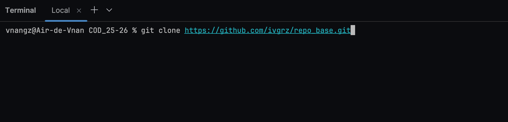
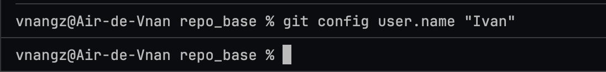

# <u>Resolucion de las preguntas<u>

1. Clonar repositorio externo

2. Configurar nueva identidad del usuario

3. Añadir nuevo repositorio local

4. Eliminar el repositorio inicial

5. Realizar cambios y commit

6. Realizar el push al nuevo remoto

7. Verificacion

